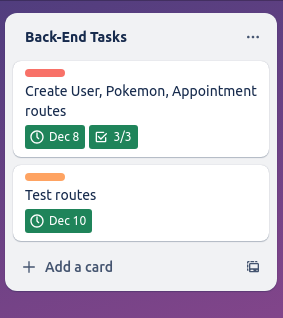
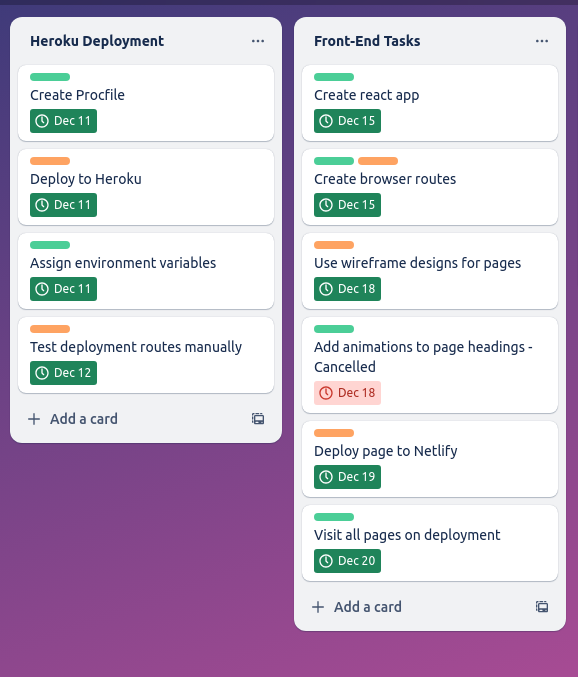
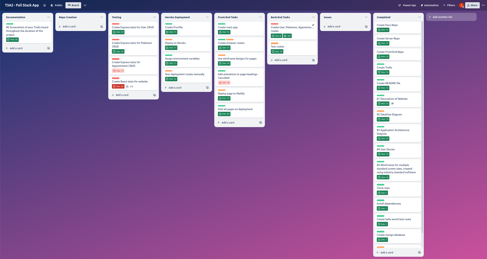
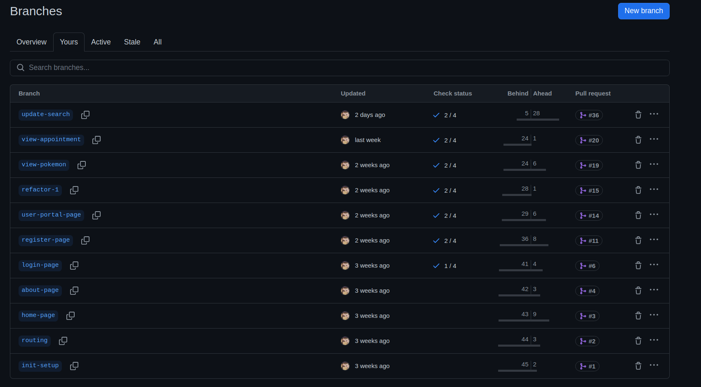
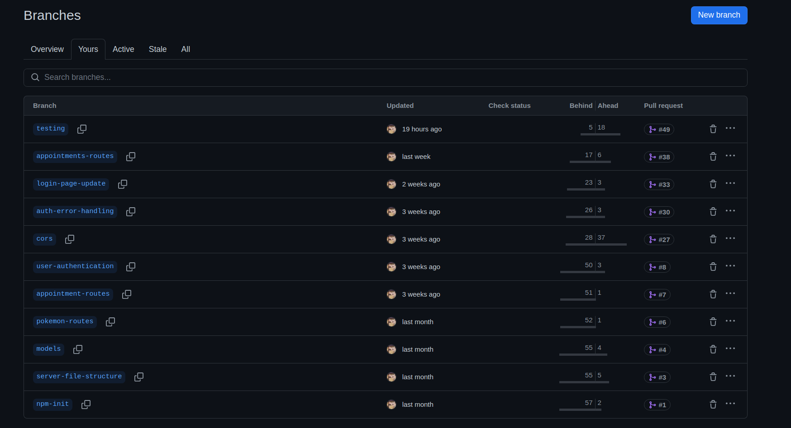

Logo credit to my good friend, [Lochy.](https://www.linkedin.com/in/lochlyn-thomas-045b55289/)

### Front End: https://pokemondaycare.tech/

### Back End: https://api.pokemondaycare.tech/

### Front End Repository: https://github.com/zakaryjs/PokemonDayCare-Frontend

### Back End Repository: https://github.com/zakaryjs/PokemonDayCare-Server

Everyone knows the Pokemon daycare. Whether you were too lazy to farm exp, were trying to breed that perfect competitive mon, or just wanted to hatch a shiny - the daycare has always been there to help make that possible.

## Libraries Used

### React
A JavaScript library created by Meta that is used for building component-based user interfaces. React is what this app was built with, though other packages were also used throughout development.

### React-Router-Dom
A React package that allows for seamless navigation throughout a single page application. In this app, it is used to control navigation through the navbar, in buttons, and through automatic redirects after certain actions are completed.

### CoreUI 
A package that contains a variety of pre configured components for use within a React application. In this app, it is used for the footer.

### Material UI / Emotion / Material UI X Date Pickers
A package that, like CoreUI contains a variety of pre configured components for use within a React application. In this app, it is used in conjunction with dayJS in order to provide the date pickers that are used in the create appointment page.

### DayJS
DayJS is a JavaScript library that is used to manage dates in JavaScript applications. It is capable of validating, displaying and manipulating dates in various formats. In this application, it is used as an adapter for the date provider that is used for the Material UI date pickers.

### Bootstrap / React Bootstrap
A package that, like CoreUI and Material UI contains a variety of pre configured components for use within a React application. In this application, it is used for the buttons that can be seen in various places throughout the application.

### React Icons
A package that provides hundreds of pre configured icons for use within a React Applications. It includes icons from places such as FontAwesome and Bootstrap. In this app, it is used for the trash icon that is used for deleting pokemon and appointments. 

### React Loader Spinners
A package that provides a variety of pre configured loader spinners. In this app, the grid and circle spinners are used in account and creation related pages. 

### Jest
Jest is a JavaScript testing framework that can be used for testing different parts of app functionality. Jest supports function and data mocking, as well as providing checks for code coverage. In this project, Jest is used with React Testing Library in order to test the application.

### React Testing Library
React Testing Library is a package that is used to test React components. It works in conjunction with Jest in order to provide a way to test a React App. In this app, it is used to test a variety of components.

## Project Management

** All tasks were allocated to me, as I completed this project solo. Though I consider myself to be stronger in the frontend rather than the backend, it was a good learning experience and a good way to push myself outside of the comfort zone.

Screenshots taken throughout the duration of Part B:

December 10


December 14


December 21


As per my plan in Part A, I began the second part of the project by working through the backend. The process was as follows:

- Create models

- Create basic functions

- Create routes with said functions

- Manually test these routes, with multiple different scenarios in order to fully test functionality and try and find edge cases

- If any bugs are found, pause development and work to fix them

- Deploy the server

I then began work on the front end:

- Create basic pages

- Create account portal

- Create functionality relating to account portal

- Make fetch requests to the server

At this point in the project, I had to figure out how to store and use the JWT. 

This was one of the major hurdles I had in the project, as I really struggled to figure out how to create and store cookies properly. After a few days of testing, they finally worked, however:

I read that 3rd party cookies where soon to be blocked by browsers, and, after testing on mobile devices I figured out that Safari blocks third party cookies anyway. 

The solution? A custom domain. The next few days were spent configuring Netlify, Heroku and domain DNS' in order to get this to work. I am really proud of this. 

The remainder of the project was spent:

- Finalising functionality (more pages, redirects, custom hooks)

- Adding styling

- Writing tests for both the front and back end. 

- Writing documentation

#### Front End Branches



For the branches, I separated each major feature into its own branch. These were designed to be similar to the tasks that I had outlined in the Trello. The ```update-search``` branch was definitely the biggest - it was used to update page search functionality, as well as make many other small changes.

Smaller page specific branches were also deleted throughout the duration of the project.



For the branches, I again separated each major feature into its own branch. These were again designed to be similar to the tasks that I had outlined in the Trello. These were more separated than the front end branches, as overall less time was spent on the backend. 